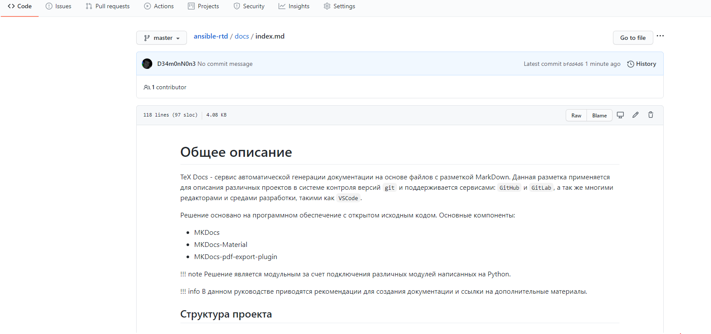
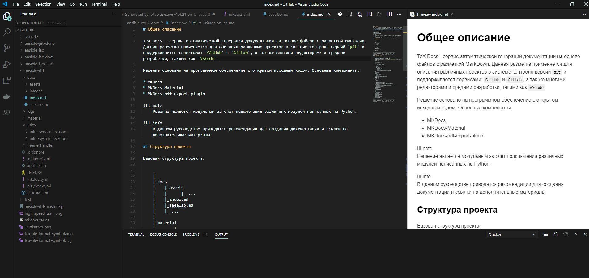

# Общее описание

TeX Docs - сервис автоматической генерации документации на основе файлов с разметкой MarkDown. Данная разметка применяется для описания различных проектов в системе контроля версий `git` и поддерживается сервисами: `GitHub` и `GitLab`, а так же многими редакторами и средами разработки, такими как `VSCode`.

---
{.border}
---
{.border}
---

Решение основано на программном обеспечение с открытом исходным кодом. Основные компоненты:

* MKDocs
* MKDocs-Material
* MKDocs-pdf-export-plugin

!!! note "Примечание"
    Решение является модульным за счет подключения различных модулей написанных на Python.

!!! info "Для информации"
    В данном руководстве приводятся рекомендации для создания документации и ссылки на дополнительные материалы. 

## Структура проекта

Базовая структура проекта:

    .
    |
    |-docs
    |    |-assets
    |    |      |_ ...  
    |    |_index.md
    |    |_seealso.md
    |    |_ ...
    |
    |-material
    |        |_ ...
    |
    |
    |_mkdocs.yml

| Директории и файлы       | Описание                                |
|:------------------------:|:----------------------------------------|
| docs                     | основная директория с документацией     |
| material                 | тема формирования стиля `html` страниц  |
| mkdocs.yml               | конфигурационный файл с настройками     |

## Файл конфигурации проекта  

??? example "texdocs.yml"
    ``` yaml
    site_name: "\< Название документации >\"
    site_author: "\< Автор >\"
    site_description: >-
      \< Название под которым документ будет опубликован в TexDocs >\
    
    repo_name: \< Идентификатор git репозитории >\
    repo_url: \< URL git репозитории >\
    edit_uri: ""
    
    use_directory_urls: false
    copyright: Copyright &copy; <a href="\< Адрес сайта автора >\">\< Автор >\</a>.
    
    nav:
        - '\< Название главной страницы >\': 'index.md'
        - '\< Название раздела >\':
            - '\< Название страницы >\': '\<  >\.md'
    plugins:
      - autolinks
      - search:
          lang:
            - en
            - ru
      - section-index
      - table-reader
      - thumbnails:
          style: margin-top:5px;margin-bottom:5px;margin-right:25px  
      - git-revision-date-localized
      - git-revision-date
      - macros
      - minify:
          minify_html: true
      - with-pdf:
          copyright: \< Автор >\
          cover_subtitle: ''
          output_path: \< Имя файла PDF >\.pdf
    
    extra_css:
        - assets/extra.css
    
    extra_javascript:
      - assets/extra.js
      - assets/tex-mml-chtml.js
    
    theme:
      name: material
      custom_dir: material
      language: ru
      features:
        - content.tabs.link
        - navigation.indexes
        - navigation.top
        - navigation.tracking
        - search.highlight
        - search.share
        - search.suggest
        - toc.integrate
      palette:
        - scheme: default
          primary: blue grey
          accent: red
      font:
        text: Roboto
        code: Roboto Mono
      favicon: assets/img/favicon/favicon.png
      logo: assets/img/logo/logo.svg
    
    markdown_extensions:
      - admonition
      - codehilite:
          linenums: true
      - toc:
          permalink: true
          slugify: !!python/name:pymdownx.slugs.uslugify
      - meta
      - pymdownx.betterem:
          smart_enable: all
      - pymdownx.caret
      - pymdownx.details
      - pymdownx.inlinehilite
      - pymdownx.magiclink
      - pymdownx.mark
      - pymdownx.smartsymbols
      - pymdownx.superfences
      - pymdownx.tabbed
      - pymdownx.betterem:
          smart_enable: all
      - pymdownx.keys
      - pymdownx.tasklist:
          custom_checkbox: true
      - markdown_blockdiag:
          format: svg
      - markdown_include.include
      - markdown.extensions.attr_list 
    
    extra:
      generator: false
      homepage: http://\<URL main site>\
      social:
        - icon: fontawesome/solid/home
          link: http://\<URL main site>\
          name: Tex-docs
        - icon: fontawesome/brands/gitlab
          link: https://\<URL git server>\
    ```

| Разделы и параметры      | Описание                                                                    |
|:------------------------:|:----------------------------------------------------------------------------|
| site_name                | Имя проекта                                                                 |
| site_description         | Описание проекта                                                            |
| repo_name                | Имя проекта в `git`, необходимо для формирования ссылки для редактирования  |
| repo_url                 | Ссылка на проект в `git`                                                    |
| nav                      | Подключаемые файлы с документацией                                          |
| plugins                  | Подключяемые расширения                                                     |
| output_path              | Имя файла `pdf`. По умолчанию: `combined.pdf`                               |
| theme                    | Тема оформления `html` страниц                                              |
| extra                    | Дополнительные настройки                                                    |
| markdown_extensions      | Модули обработки разметки                                                   |

## Установленные расширения

??? done "Список расширений"
    * mike
    * WeasyPrint>=44
    * click-man
    * mkpdfs-mkdocs
    * mkdocs-autozip
    * mkdocs-encryptcontent-plugin
    * mkdocs-exclude
    * mkdocs-bootstrap-tables-plugin
    * mkdocs-macros-plugin
    * mkdocs-material>=5.3.3
    * mkdocs-material-extensions>=1.0
    * mkdocs-git-revision-date-plugin
    * mkdocs-git-revision-date-localized-plugin
    * mkdocs-markdownextradata-plugin
    * mkdocs-mdpo-plugin
    * mkdocs-minify-plugin
    * mkdocs-newsletter
    * mkdocs-rss-plugin
    * mkdocs-section-index
    * mkdocs-table-reader-plugin
    * mkdocs-tooltipster-links-plugin
    * mkdocs-thumbnails
    * mkdocs-user-defined-values
    * mkdocs-vim-md-tags-plugin
    * mkdocs-with-pdf
